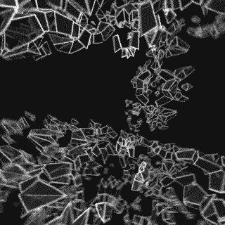

# Everyday One Motion - 20160121  

"IFS Storm"  

  

Raymarching, IFS  

[Everyday One Motion](http://motions.work/motion/82)  
[Demo Page](http://fms-cat-eom.github.io/20160128/)  

## IFS

[Flactal Lab](http://hirnsohle.de/test/fractalLab/) というサービスが有って、これはWeb上で動く、非常に高機能なレイマーチングフラクタルビューアです。  
描画に用いるGLSLシェーダのコードが簡単に閲覧できるようになっているのですが、この中にあった `vec3 OctahedralIFS` という関数に手を加えたものを今回用いています。  

## Reflection

レイマーチングは、光を再帰的に進め衝突した物体を描画します。  
このとき、現在の光の向きと衝突した物体との法線を利用し、光の向きを変えて再び光を進めてやるだけで、とても簡単に反射が実現できます。  
ただし、一度衝突した地点からさらに光を進ませるため、計算量は反射の回数に比例となります…  

## 今回のパス
    10 times {
      - レイマーチング
      - ブラー
    }

今回は激重。  
ただでさえ高級なIFSの描画に加え、レイマーチングで反射のため光を3回飛ばし、それをモーションブラーのため10回レンダリングしているので、地獄です。  
ちなみに作業PCはMacBook Pro 13inchです。確かにもっと速いPCほしいですけど、割と現状で満足しています。  
